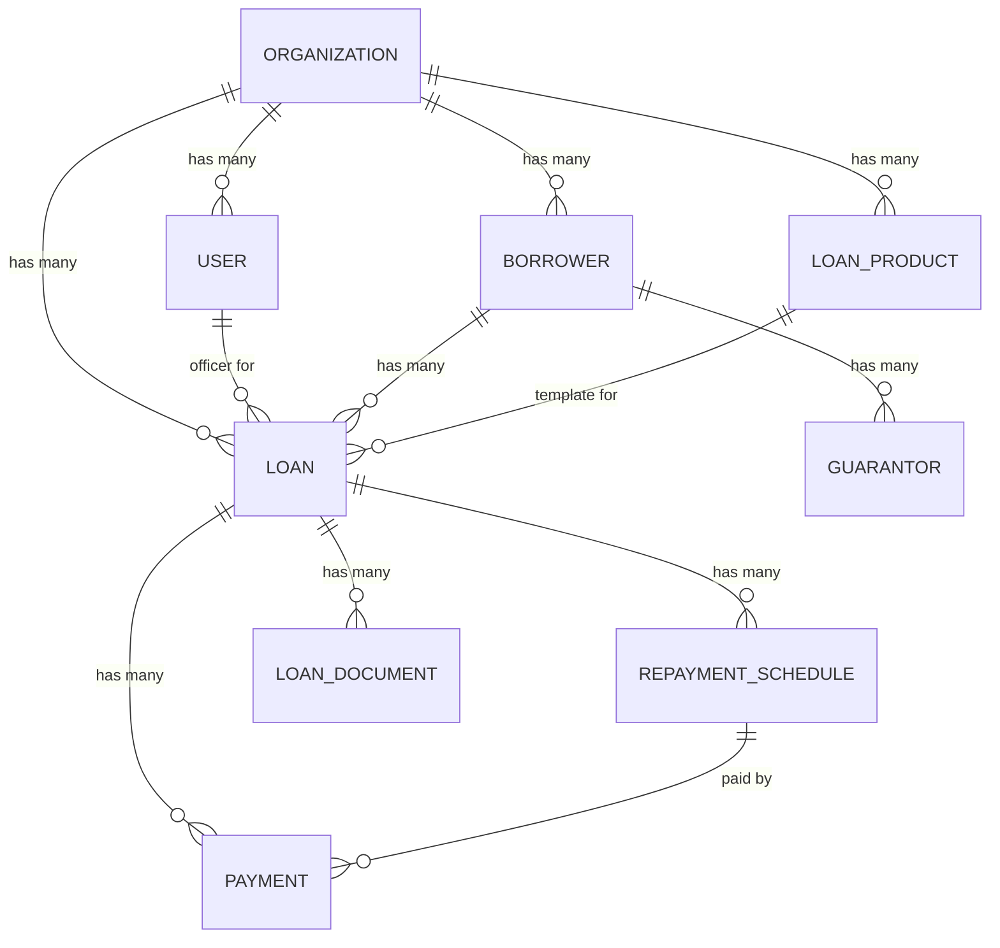

# HF Finance — Loan SaaS Product

A multi-tenant Loan Management SaaS built with **Laravel 13 + Filament 3 + MySQL/PostgreSQL**.

## Background & Goals

Build a production-grade Loan SaaS platform that enables lending organizations (MFIs, NBFCs, cooperatives, fintech lenders) to:

- Onboard borrowers and manage KYC documents
- Configure flexible loan products (interest type, tenure, fees)
- Originate, approve, disburse, and track loans through their full lifecycle
- Auto-generate EMI schedules & amortization tables
- Record payments, track delinquency, and trigger collection reminders
- View real-time dashboards with portfolio health metrics
- Operate as isolated tenants (organizations) on a shared platform

---

## User Review Required

> [!IMPORTANT]
> **Multi-Tenancy Strategy**: The plan uses a **single-database** approach with a `organization_id` foreign key and Eloquent Global Scopes. This is simpler and cheaper to operate but provides only logical (not physical) data isolation. If you need enterprise-grade physical isolation (separate DB per tenant), we should switch to `stancl/tenancy` — but that significantly increases DevOps complexity.

> [!IMPORTANT]
> **Admin Panel**: We'll use **Filament 3** as the admin panel framework. It gives us beautiful, feature-rich CRUD interfaces, dashboard widgets, role-based navigation, and form builders out of the box — dramatically reducing development time. The borrower-facing portal (self-service) is planned for Phase 2.

> [!WARNING]
> **Prerequisites**: You need **PHP 8.3+**, **Composer**, **Node.js 18+**, and **MySQL 8.0+ or PostgreSQL 15+** installed locally. Please confirm your environment before we proceed.

---

## Tech Stack

| Layer | Technology |
|---|---|
| **Framework** | Laravel 13 (PHP 8.3+) |
| **Admin Panel** | Filament 3 |
| **Database** | MySQL 8.0+ / PostgreSQL 15+ |
| **Auth & Roles** | Laravel Sanctum + Spatie Permission |
| **Multi-Tenancy** | Single DB with `organization_id` + Global Scopes |
| **Queue / Jobs** | Laravel Queue (database driver initially) |
| **Notifications** | Laravel Notifications (mail, database) |
| **PDF Generation** | barryvdh/laravel-dompdf |
| **Testing** | Pest PHP |
| **Frontend Assets** | Vite (ships with Laravel) |

---

## Proposed Changes

### Phase 1 — Foundation & Core Models

---

#### 1. Project Scaffolding

##### [NEW] Laravel Project
- `composer create-project laravel/laravel .` in `d:\Sayan\Projects\HF_Finance`
- Install packages: `filament/filament`, `spatie/laravel-permission`, `barryvdh/laravel-dompdf`
- Configure `.env` for database, mail, app name

---

#### 2. Database Schema & Models

##### Core Tables & Relationships

```
organizations
├── id, name, slug, logo, address, phone, email, settings (JSON)
├── has many: users, borrowers, loan_products, loans
│
users
├── id, organization_id, name, email, password, phone, avatar
├── belongs to: organization
├── roles: super_admin, org_admin, loan_officer, accountant, collector
│
borrowers
├── id, organization_id, first_name, last_name, email, phone
├── gender, date_of_birth, national_id, address, city, state, country
├── occupation, employer, monthly_income, credit_score
├── kyc_status (pending/verified/rejected), kyc_documents (JSON)
├── photo, notes, status (active/inactive/blacklisted)
├── has many: loans, guarantors
│
guarantors
├── id, borrower_id, name, phone, email, relationship, national_id, address
│
loan_products
├── id, organization_id, name, code, description
├── min_amount, max_amount, interest_rate, interest_type (flat/declining/compound)
├── min_tenure_months, max_tenure_months, repayment_frequency (monthly/weekly/biweekly/daily)
├── processing_fee_type (fixed/percentage), processing_fee_value
├── late_penalty_type (fixed/percentage), late_penalty_value, grace_period_days
├── requires_guarantor, requires_collateral, status (active/inactive)
│
loans
├── id, organization_id, borrower_id, loan_product_id, loan_officer_id (user)
├── loan_number (unique), applied_amount, approved_amount, disbursed_amount
├── interest_rate, interest_type, tenure_months, repayment_frequency
├── processing_fee, total_interest, total_payable
├── purpose, collateral_type, collateral_value, collateral_description
├── status (pending → under_review → approved → disbursed → active → completed → defaulted → written_off)
├── applied_at, reviewed_at, approved_at, rejected_at, disbursed_at, closed_at
├── approved_by, rejected_by, disbursed_by
├── rejection_reason, notes
├── has many: repayment_schedules, payments
│
repayment_schedules
├── id, loan_id, installment_number
├── due_date, principal_amount, interest_amount, total_amount
├── paid_amount, paid_at, balance
├── status (pending/paid/partial/overdue/waived)
├── late_fee_charged, days_overdue
│
payments
├── id, loan_id, repayment_schedule_id (nullable)
├── amount, payment_method (cash/bank_transfer/mobile_money/cheque/online)
├── reference_number, payment_date, received_by (user_id)
├── notes, receipt_number
│
loan_documents
├── id, loan_id, document_type, file_path, uploaded_by, description
│
audit_logs  (via spatie/activitylog or custom)
├── id, organization_id, user_id, action, model_type, model_id, changes (JSON), ip_address
```

##### [NEW] Migration files (one per table above)
##### [NEW] Eloquent Models with relationships, casts, scopes

---

#### 3. Multi-Tenancy Layer

##### [NEW] `app/Traits/BelongsToOrganization.php`
- Trait that auto-applies `organization_id` global scope
- Auto-sets `organization_id` on model creation from `auth()->user()->organization_id`

##### [NEW] `app/Models/Scopes/OrganizationScope.php`
- Global scope: `->where('organization_id', auth()->user()->organization_id)`

---

#### 4. Roles & Permissions (Spatie)

##### [NEW] `database/seeders/RolesAndPermissionsSeeder.php`

| Role | Permissions |
|---|---|
| **super_admin** | Full access to all organizations (platform owner) |
| **org_admin** | Full access within own organization |
| **loan_officer** | Manage borrowers, create/review loans, record payments |
| **accountant** | View loans, manage payments, generate reports |
| **collector** | View assigned loans, record field payments |

---

### Phase 2 — Filament Admin Panel

---

#### 5. Filament Resources (CRUD)

##### [NEW] `app/Filament/Resources/OrganizationResource.php`
- Super admin only — manage organizations

##### [NEW] `app/Filament/Resources/BorrowerResource.php`
- Full CRUD with KYC document upload
- Tabs: Personal Info, Employment, KYC, Loans History
- Actions: Verify KYC, Blacklist

##### [NEW] `app/Filament/Resources/LoanProductResource.php`
- Configure loan templates with interest types, fees, tenure ranges

##### [NEW] `app/Filament/Resources/LoanResource.php`
- Full loan lifecycle management
- Custom Actions: Review, Approve, Reject, Disburse
- Relation Managers: Repayment Schedule, Payments, Documents
- Infolist: Loan summary view with amortization table

##### [NEW] `app/Filament/Resources/PaymentResource.php`
- Record payments against loans/installments
- Auto-calculate remaining balance, mark installments as paid

##### [NEW] `app/Filament/Resources/UserResource.php`
- Manage staff users within org, assign roles

---

#### 6. Dashboard Widgets

##### [NEW] `app/Filament/Widgets/`

| Widget | Content |
|---|---|
| `StatsOverview` | Total loans, active loans, disbursed amount, overdue count |
| `LoansByStatusChart` | Doughnut chart of loan statuses |
| `MonthlyDisbursementChart` | Bar chart — monthly disbursement trend |
| `RecentLoansTable` | Latest 10 loans with status badges |
| `OverdueInstallments` | Upcoming/overdue installments needing attention |
| `CollectionSummary` | Payments received today/this week/this month |

---

### Phase 3 — Business Logic & Financial Engine

---

#### 7. EMI & Amortization Engine

##### [NEW] `app/Services/LoanCalculatorService.php`

```php
class LoanCalculatorService
{
    // Flat interest: Interest = P × R × T, EMI = (P + Interest) / N
    public function calculateFlat(float $principal, float $rate, int $months): LoanSchedule;

    // Declining balance: EMI = [P × r × (1+r)^n] / [(1+r)^n - 1]
    public function calculateDeclining(float $principal, float $rate, int $months): LoanSchedule;

    // Generate full amortization schedule with principal, interest, balance per installment
    public function generateSchedule(Loan $loan): Collection;

    // Recalculate on prepayment
    public function recalculateOnPrepayment(Loan $loan, float $prepaymentAmount): Collection;
}
```

##### [NEW] `app/Services/PaymentService.php`
- Apply payment to oldest due installment (FIFO)
- Handle partial payments, overpayments, advance payments
- Auto-close loan when fully paid

##### [NEW] `app/Services/PenaltyService.php`
- Calculate late fees based on loan product config
- Apply penalties on overdue installments

---

#### 8. Automated Jobs & Notifications

##### [NEW] `app/Jobs/CheckOverdueInstallments.php`
- Scheduled daily: mark overdue installments, apply penalties, send reminders

##### [NEW] `app/Jobs/GenerateMonthlyReport.php`
- Scheduled monthly: generate portfolio summary

##### [NEW] `app/Notifications/`
- `InstallmentDueReminder` — 3 days before due date
- `InstallmentOverdue` — on overdue
- `LoanApproved` / `LoanDisbursed` / `LoanRejected`
- `PaymentReceived` — confirmation receipt

---

### Phase 4 — Reports & PDF

---

#### 9. Reports

##### [NEW] `app/Filament/Pages/Reports/`

| Report | Description |
|---|---|
| `LoanPortfolioReport` | Active loans, PAR (Portfolio at Risk), aging analysis |
| `DisbursementReport` | Loans disbursed in period with amounts |
| `CollectionReport` | Payments received, collection efficiency |
| `BorrowerReport` | Borrower demographics, loan history |
| `OverdueReport` | Delinquent loans with days overdue, contact info |

##### PDF generation via `barryvdh/laravel-dompdf`
- Loan agreement letter
- Repayment schedule printout
- Payment receipt
- Individual borrower statement

---

## Database ER Diagram



---

## Execution Phases

| Phase | Scope | Estimated Effort |
|---|---|---|
| **Phase 1** | Project setup, DB schema, models, tenancy, roles/permissions, seeders | First |
| **Phase 2** | Filament resources, forms, tables, actions, dashboard widgets | Second |
| **Phase 3** | EMI calculator, payment service, penalty engine, scheduled jobs, notifications | Third |
| **Phase 4** | Reports pages, PDF generation, loan agreement templates | Fourth |

---

## Open Questions

> [!IMPORTANT]
> 1. **Database**: Do you prefer **MySQL** or **PostgreSQL**?
> 2. **Product Name**: Should we keep it as **HF Finance** or do you have another name?
> 3. **Currency**: What is the default currency? (INR, USD, etc.)
> 4. **Interest types**: Do you need **compound interest** in addition to flat and declining balance?
> 5. **Borrower Portal**: Do you want a self-service portal where borrowers can check their loan status & pay online (Phase 2 scope)?
> 6. **Payment Gateway**: Any specific payment gateway integration needed (Razorpay, Stripe, etc.)?
> 7. **SMS Notifications**: Do you want SMS notifications for borrowers (Twilio, MSG91, etc.)?
> 8. **Scope for MVP**: Should we build all 4 phases, or start with **Phase 1 + 2** as the MVP and iterate?

---

## Verification Plan

### Automated Tests
- **Unit Tests**: `LoanCalculatorService` — verify EMI calculations for flat/declining interest against known values
- **Feature Tests**: Loan lifecycle (create → approve → disburse → pay → close)
- **Browser Tests**: Filament admin panel CRUD flows via browser subagent
- Run: `php artisan test`

### Manual Verification
- Seed demo data (sample org, users, borrowers, loan products, loans)
- Walk through complete loan lifecycle in Filament panel
- Verify dashboard widgets show correct aggregations
- Generate PDF reports and verify formatting
